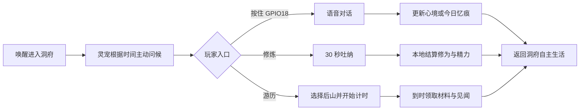

# 游戏玩法与入口规划

## 1. 产品体验目标

这不是把传统修仙手游缩进 2.16 英寸屏幕，而是一只会持续生活、能语音陪伴、每天都有少量变化的修仙灵宠。

设计原则：

- **先见宠物，再见菜单**：唤醒设备后直接进入洞府，灵宠始终是主角。
- **短操作、长陪伴**：单次主动操作控制在 10 秒到 3 分钟，成长持续数天、数月和多世。
- **离线也完整**：断网时仍可修炼、游历、领取结果、播放动画和读写存档。
- **AI 增加生命感，不决定数值**：LLM 负责对白、情绪表达和叙事建议；奖励、消耗、战斗和突破由本地规则计算。
- **入口少而稳定**：首页只保留高频动作，低频功能进入洞府菜单，不堆满小图标。
 
## 2. 三层游戏循环

### 即时循环：10 秒到 3 分钟

1. 唤醒设备，观察灵宠当前动作、情绪和一句主动台词。
2. 触摸灵宠、按住说话，或选择一个行动。
3. 完成一次短互动：对话、修炼、喂养、收取游历结果或处理事件。
4. 获得明确反馈：动画、音效、情绪变化、材料或修为。
5. 灵宠回到洞府继续自主生活。

### 每日循环：1 天

1. 早晨问候，生成当天心境和一条小目标。
2. 白天安排修炼或游历，玩家现实中的专注事件可提供有限加成。
3. 晚上领取结果、回顾当天对话和事件。
4. 形成一条结构化“今日忆痕”，影响后续对白和人格。

### 长期循环：数周到多世

积累修为与羁绊 → 满足破境条件 → 经历心魔或雷劫事件 → 获得新能力与外观变化 → 寿元终点或主动转生 → 留下本命神通、性格痕迹和前世记忆。

V0.1 只实现第一境界内的成长与一次破境演示；完整转生系统仅保留数据接口。

## 3. 核心状态

V0.1 只保留足以支撑决策的状态，避免复杂数值面板。

| 状态 | 作用 | 主要变化来源 |
|---|---|---|
| 修为 | 境界成长的长期进度 | 修炼、游历、事件 |
| 精力 | 限制连续行动，随时间恢复 | 行动消耗、睡眠恢复 |
| 心境 | 影响修炼效率、对白和事件倾向 | 对话、抚摸、失败、天气、作息 |
| 羁绊 | 表示玩家与灵宠的长期关系 | 陪伴、兑现承诺、共同事件 |
| 灵石 | V0.1 的通用资源 | 游历、任务、事件奖励 |
| 材料 | 用于炼丹和后续制作 | 游历、事件、战斗 |

饥饿、口渴、清洁等传统电子宠物数值暂不加入，避免玩家被日常维护绑架。需要表达照顾感时，通过“精力、心境和灵宠行为”呈现。

## 4. 默认首页：随身洞府

480×480 首页保持一屏完成高频操作：

```text
┌────────────────────────┐
│ 境界/修为       时间/电量 │
│                        │
│        灵宠主体          │
│   动作、表情、气泡台词     │
│                        │
│  修炼   游历   丹炉   札记  │
└────────────────────────┘
```

首页规则：

- 中央约 70% 区域留给灵宠、洞府背景和事件动画。
- 顶部只显示境界、修为提示、时间、电量和联网状态。
- 底部四入口与未来 K1–K4 实体键位置保持一致。
- 有游历结果、破境条件或重要记忆时，在对应入口显示一个克制的提示点。
- 不使用常驻滚动聊天记录；当前对白以气泡和字幕短暂显示，完整记录进入札记。

## 5. 一级入口

### 5.1 灵宠本体

点击灵宠触发抚摸、查看状态或一条情境反馈。不同动作区域可以产生轻量差异，但不设计需要精确点击的小热区。

- 单击：抚摸或互动。
- 长按屏幕：打开灵宠状态卡。
- 灵宠主动冒泡：点击进入对应事件。

### 5.2 语音

语音不占底部菜单位置，是随时可用的全局入口。

- `GPIO18` 按住：开始说话；松开：发送。
- 唤醒词：进入免按键会话，是否默认开启取决于功耗测试。
- 播放过程中再次按键：打断当前语音。
- 断网时：播放本地回应，并明确提示当前无法进行云端对话。

`GPIO0/BOOT` 只用于启动、烧录和开发调试，不作为正式游戏输入。接入 xiaozhi-esp32 时需将默认对话键映射从 `GPIO0` 调整到 `GPIO18`。

### 5.3 修炼

短时主动玩法，是修为的主要稳定来源。

V0.1 提供三种动作：

- 吐纳：低风险、稳定获得修为，30–60 秒。
- 练剑：触摸节奏或按键时机玩法，表现优先于复杂判定。
- 入定：开始一个现实专注计时，完成后结算心境和修为。

每日重复收益递减，避免机械刷取。

### 5.4 游历

异步玩法，是材料、故事和意外事件的主要来源。

玩家选择地点和时长后，灵宠离开洞府。计时由 RTC 和存档共同保证，退出或断网不丢失。返回时先播放 10–20 秒结果动画，再显示确定性奖励和一段 AI 润色的游历见闻。

V0.1 只提供三个地点：后山、坊市、古井。每个地点拥有不同的材料池、事件池和风险。

### 5.5 丹炉

V0.1 为轻量制作入口，不做复杂配方树。

- 选择最多两种材料和一种火候。
- 结果由固定配方与概率表计算。
- 炼制过程显示短动画，可离开页面等待完成。
- 首轮只提供回复精力、稳定心境和游历增益三类丹药。

### 5.6 札记

承载记忆、任务和设置，避免首页继续增加入口。

札记包含：

- 今日忆痕：当天重要对话和事件摘要。
- 生平：境界、关键选择、称号和前世痕迹。
- 行囊：灵石、材料和丹药。
- 设置：音量、亮度、网络、唤醒词、隐私和设备信息。

## 6. 二级玩法及解锁顺序

| 阶段 | 玩法 | 入口 | 是否进入 V0.1 |
|---|---|---|---|
| P0 | 洞府待机、触摸互动、语音、吐纳、游历结果、今日忆痕 | 首页直接进入 | 是 |
| P1 | 练剑、入定、炼丹、随机事件、首次破境 | 首页或事件入口 | 是，完成最小版本 |
| P2 | 回合切磋、法宝、洞府装饰、现实日程联动 | 游历/札记解锁 | 否 |
| P3 | BLE 相遇、飞剑传书、洞府拜访、异步切磋 | 仙缘入口 | 否 |
| P4 | 完整寿元、多世转生、前世残魂 | 生平入口 | 否 |

未解锁系统不在首页显示灰色按钮。满足条件时通过灵宠事件自然引导解锁。

## 7. 输入映射

| 输入 | 默认行为 | 约束 |
|---|---|---|
| 触摸单击 | 选择、抚摸、确认 | 主要导航方式 |
| 左右滑动 | 切换同级卡片或分页 | 不依赖复杂多指手势 |
| GPIO18 按住 | 语音录制 | 正式语音键 |
| GPIO18 单击 | 打断语音或关闭气泡 | 不与按住说话冲突 |
| 抬起设备 | 低功耗唤醒并看向玩家 | 需通过 IMU 误触测试 |
| 轻摇 | 特定事件互动 | 禁止用于高频核心操作 |
| K1–K4 | 对应首页四入口或场景动作 | 外接按键完成后启用 |
| PWR | 开关机/唤醒 | 不承担游戏动作 |
| GPIO0/BOOT | 烧录和恢复 | 不承担游戏动作 |

## 8. AI 与本地规则边界

| AI 可以做 | AI 不可以做 |
|---|---|
| 生成对白、语气和短故事 | 直接增加修为、灵石或物品 |
| 从白名单选择情绪和动画建议 | 解锁境界、技能或地图 |
| 将本地结算结果写成游历见闻 | 决定战斗胜负和炼丹结果 |
| 提取玩家提到的人物、偏好和承诺 | 覆盖存档或修改系统时间 |
| 建议一个结构化事件候选 | 调用未注册 MCP 工具 |

所有 AI 输出先转换成版本化结构，再由本地引擎校验和执行。

## 9. V0.1 第一条完整闭环



首个可玩版本完成标准：玩家每天愿意至少打开三次，能看见灵宠状态变化、完成一次语音互动、安排一次行动并在晚间得到一条可回顾的记忆。

## 10. 实施顺序

1. 洞府首页静态布局和灵宠待机动画。
2. 本地状态模型、RTC 时间推进和 A/B 存档。
3. GPIO18 语音入口与小智会话状态映射。
4. 吐纳玩法及确定性结算。
5. 后山游历计时、离线结算和结果页面。
6. 今日忆痕生成、保存和札记查看。
7. 心境影响动画与对白。
8. 首次破境演示。
9. 再评估炼丹、练剑和外接 K1–K4 的优先级。
