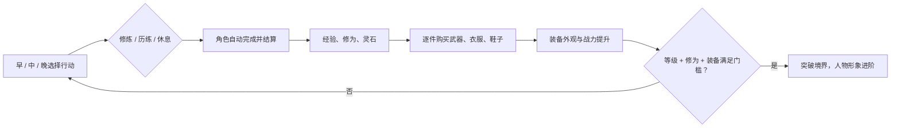

# 游戏玩法与入口规划

> 本文以 [修仙人物陪伴玩法设计](superpowers/specs/2026-07-23-cultivator-companion-gameplay-design.md) 为准；后续玩法变更先更新该设计，再同步本文。

## 1. 产品定位

这不是灵宠养成，也不是把重度修仙手游缩进 2.16 英寸屏幕。设备中的主角是一名自动成长的修仙人物；玩家是其引路人与陪伴者，安排日常修行、积累灵石、购买装备，并见证其最终飞升。

设计原则：

- **人物是主角**：开局选择男性或女性主角，屏幕中心始终呈现人物、装备与境界变化。
- **三次轻决策，全天自动成长**：每天早、中、晚各选一次行动；角色自行完成修炼、历练与自动战斗。
- **无失败惩罚**：不死亡、不掉级、不损失灵石、不损坏装备。战力不足只降低本次历练收获。
- **外观即成长反馈**：装备单件即时改变外观；境界突破改变人物整体风格、动作与气场。
- **AI 提供人格，不篡改规则**：小智是人物的声音与灵魂，负责世界观内对话和叙事；本地规则决定一切数值。

## 2. 核心循环



每天分为早、中、晚三个独立时段：

- 玩家每个时段选择一次修炼、历练或休息。
- 同一天重复同一行动时，后续收益轻微递减。
- 错过时段时角色自动休息；不追责、不扣资源。
- 修炼稳定产出经验与修为。
- 历练以灵石为主要产出，并由角色自动战斗。
- 休息不直接产出资源，但提供状态恢复或下一次行动的小幅加成。

## 3. 成长、资源与装备

### 3.1 三种资源

| 资源 | 用途 | 主要来源 |
|---|---|---|
| 经验 | 提升人物等级 | 修炼、历练 |
| 修为 | 满足境界突破条件 | 修炼、历练 |
| 灵石 | 购买三件装备 | 历练为主 |

首版不加入材料、炼丹、装备强化、随机词条、装备损坏、掉级、羁绊、精力、心境或转生。

### 3.2 装备

角色开局拥有 0 级凡品武器、衣服、鞋子。达到装备等级门槛后，玩家使用灵石在商店分别购买对应装备：

| 部位 | 属性 | 游戏作用 |
|---|---|---|
| 武器 | 攻击 | 提高自动战斗效率与历练收益 |
| 衣服 | 防御 | 降低低收益、提前返程的概率 |
| 鞋子 | 速度 | 缩短历练耗时或提高探索效率 |

规则：

- 已购买装备立即穿戴，立即改变属性与人物外观。
- 三件装备允许混搭不同等级。
- 三件装备等级相同且非 0 级时，显示纯视觉套装特效；不额外提供数值加成。
- 更高等级装备必须先由人物等级解锁，不能提前购买。
- 战力不足不会失败，只会使本次历练收益较低或提前结束。

### 3.3 境界与突破

人物从 1 级成长到 100 级，每十级为一个境界阶段：

| 等级 | 境界 |
|---|---|
| 1–10 | 炼气 |
| 11–20 | 筑基 |
| 21–30 | 金丹 |
| 31–40 | 元婴 |
| 41–50 | 化神 |
| 51–60 | 炼虚 |
| 61–70 | 合体 |
| 71–80 | 大乘 |
| 81–90 | 渡劫 |
| 91–100 | 飞升；100 级完成最终飞升 |

每个十级节点的突破同时需要：

1. 人物达到目标等级。
2. 修为达到该节点要求。
3. 武器、衣服、鞋子均达到该节点的最低装备等级。

突破不会失败或消耗已有资源。成功后更新境界、服装基调、发型或体态、待机动作、修炼特效、气场与角色台词。

## 4. 默认首页与入口

```text
┌────────────────────────────┐
│ 境界 · 等级 · 修为     灵石 │
│                            │
│          修仙人物           │
│   装备外观 · 动作 · 气泡台词 │
│                            │
│   修炼      历练      休息   │
│         状态 / 商店          │
└────────────────────────────┘
```

- 中央区域显示人物、洞府背景、装备外观和关键成长动画。
- 顶部显示境界、等级/经验提示、修为、灵石、时间、电量和联网状态。
- 底部固定入口为修炼、历练、休息和状态；状态卡内进入商店和突破。
- 对话是全局能力，由现有按键或唤醒词进入，不占用每日行动名额。
- 角色气泡用于短对白、行动结果、装备购买反馈和突破提示；不常驻显示聊天记录。

## 5. 小智陪伴对话

小智不是设备助手，也不是第三方旁白，而是玩家所选修仙人物本身。

- 人物始终以修仙世界观内口吻交流。
- 它可结合自身当前性别、境界、等级、装备、当日行动和近期历练回应聊天。
- 它可在出发、结算、购入装备、同级三件套集齐和突破时生成短台词与情绪表达。
- 它可保留称呼与少量互动偏好，增加连续陪伴感。
- 聊天不改变经验、修为、灵石、装备、战斗结果或突破条件。
- 当前阶段不支持通过自然语言直接选择行动、购买装备或突破；这些操作只由本地 UI 发起。

## 6. 输入映射

| 输入 | 默认行为 |
|---|---|
| 触摸单击 | 选择行动、确认、打开状态或商店 |
| 左右滑动 | 切换状态卡、装备页或商店页 |
| GPIO0/BOOT 或已验证语音入口 | 开始/打断语音对话 |
| K1–K4（外接按键完成后） | 对应首页四入口 |
| PWR | 开关机与唤醒 |

## 7. 本地规则与服务端边界

| 本地规则负责 | 服务端/小智负责 |
|---|---|
| 时段、重复收益、经验、修为、灵石 | 人设、语音、世界观内对白 |
| 装备解锁、价格、穿戴、属性与套装视觉状态 | 根据结构化状态编写结算见闻 |
| 自动战斗结算与历练收益 | 情绪、动作与短叙事建议 |
| 突破门槛与突破结果 | 记住称呼和少量互动偏好 |

AI 或服务端不能直接修改本地存档、奖励、装备、战斗结果、境界或系统时间。所有 AI 输出都必须作为展示内容或受限建议处理。

## 8. V0.1 完成标准

- 玩家可以创建男或女主角，并看到 0 级凡品装备。
- 每日早、中、晚各能完成一次行动；错过时自动休息。
- 修炼、历练、休息会按规则产出经验、修为或灵石。
- 玩家能逐件购买已解锁的装备，看到混搭和同级三件套效果。
- 每十级可按三道门槛突破并看到人物变化。
- 玩家可随时进行世界观内对话，且对话不会改变数值。
