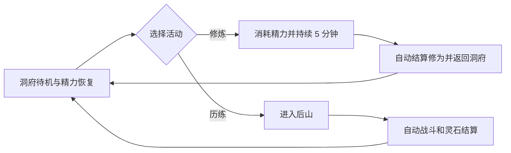

# 游戏玩法与入口规划

> 权威路线见 [下一阶段开发路线](development-phases.md)。本文只描述与当前精力制活动模型一致的入口和体验。

## 产品定位

主角是一名修仙人物，玩家安排修炼和历练、积累修为与灵石，并见证装备和外观成长。AI 负责角色化表达，不拥有数值或存档写入权限。

## 核心循环

```mermaid
flowchart LR
    A[洞府待机与精力恢复] --> B{选择活动}
    B -->|修炼| C[消耗精力并持续 5 分钟]
    B -->|历练| D[进入后山]
    C --> E[自动结算修为并返回洞府]
    D --> F[自动战斗和灵石结算]
    E --> A
    F --> A
```

- 精力上限、恢复速度和修炼消耗由本地 `GameEngine` 定义；历练不消耗精力或灵石。
- 修炼持续 `5` 分钟，开始消耗 `10` 点精力，完成后自动结算；不存在领取按钮。
- 历练将复用同一活动、自动结算、重启恢复和原子存档机制。
- 活动进行中时不能开始另一项活动；精力不足只阻止修炼，不阻止历练。
- 断电重启后依可信 RTC/网络时间恢复活动；已到期活动只结算一次。

## 成长、资源与装备

- 权威资源为修为、灵石和精力。境界、层级和进度条都由累计修为推导。
- 修为 `0` 时隐藏境界；修为 `1` 为炼气一层，每 `100` 修为提升一层，每境界 `15` 层。
- 武器、衣服、鞋子及其价格、解锁条件和战斗属性留待兵器铺阶段定稿；不得引用独立等级或经验门槛。

## 首页入口

当前首页保留四个入口：

| 入口 | 当前状态 | 后续状态 |
|---|---|---|
| 修炼 | 已开放 | 进入 5 分钟修炼活动 |
| 历练 | 未开放 | 第三阶段进入后山历练 |
| 札记 | 未开放 | 用于活动记录或角色表达，不能修改数值 |
| 商城 | 未开放 | 第四阶段替换为兵器铺 |

对话可由既有按键或语音入口进入，不占用活动名额，也不能直接开始、结算或领取活动。

## 本地与 AI 边界

| 本地规则 | AI/服务端 |
|---|---|
| 精力、活动开始与结算、修为、灵石、装备状态 | 人设、语音、短台词和结果叙事 |
| RTC 时间校验、重启恢复、NVS 原子提交 | 读取结构化状态 |
| 自动战斗结果 | 仅展示，不得修改本地存档 |

## 已废弃

早、中、晚三时段行动、休息加成、同日收益递减、独立经验/等级、十层境界和手动领取不再是产品规则。
