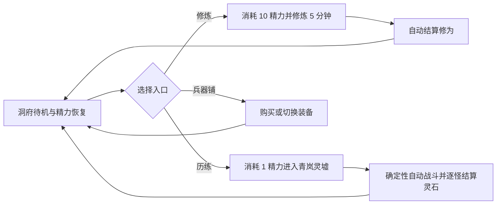

# 游戏玩法与入口规则

当前权威状态见 [Immortal Pet V2 当前玩法与开发路线](development-phases.md)。

## 核心循环

```mermaid
flowchart LR
    A[洞府待机与精力恢复] --> B{选择入口}
    B -->|修炼| C[消耗 10 精力并修炼 5 分钟]
    B -->|历练| D[消耗 1 精力进入青岚灵墟]
    B -->|兵器铺| E[购买或切换装备]
    C --> F[自动结算修为]
    D --> G[确定性自动战斗并逐怪结算灵石]
    E --> A
    F --> A
    G --> A
```

- 精力上限为 `100`，每 `5` 分钟恢复 `1` 点。
- 修炼持续 `5` 分钟并消耗 `10` 精力。
- 历练当前测试成本为 `1` 精力，只开放青岚灵墟。
- 活动进行中不能开始另一项活动。
- 修炼完成自动结算；历练按每只怪物立即结算灵石，没有领取按钮。
- 断电重启后依据可信 RTC/网络时间恢复有效活动。

## 成长与装备

- 权威资源为修为、灵石和精力。
- 修为 `0` 隐藏境界；修为 `1` 为炼气一层；每 `100` 修为提升一层，每个境界 `15` 层。
- 兵器铺提供枪、扇子和法衣。购买会扣除灵石、记录拥有状态并自动装备。
- 已拥有装备可以免费切换。
- 装备当前会改变洞府和历练人物外观；数值加成尚未接入历练伤害公式。

## 首页入口

| 入口 | 当前状态 | 行为 |
|---|---|---|
| 修炼 | 已开放 | 开始 5 分钟修炼活动 |
| 历练 | 已开放 | 进入青岚灵墟选择/确认与自动战斗 |
| 札记 | 未开放 | 显示开发中提示 |
| 商城/兵器铺 | 已开放 | 浏览、购买或切换 32 件装备 |

## 本地与 AI 边界

| 本地规则 | AI/服务端 |
|---|---|
| 精力、活动、战斗、修为、灵石、购买和装备状态 | 人设、语音、台词和结果叙述 |
| RTC 校验、重启恢复、NVS 原子提交 | 读取结构化状态 |
| 确定性随机与奖励 | 不得改写本地存档 |

## 不再使用

三时段行动、休息加成、独立经验/等级、材料、十层境界和手动领取奖励均不是当前产品规则。
