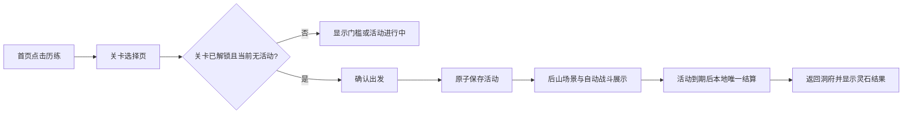

# 历练关卡设计（V0）

> 本文是第三阶段“手动历练与自动战斗”的实现基线。它复用当前的定时活动、重启恢复和原子存档模型；不使用精力成本、三时段、经验、等级、材料或手动领取。

## 目标

历练不是直接点击获得灵石。玩家从已解锁关卡中选择一处后山地点出发，不消耗精力或灵石；系统在固定时长后以确定性自动战斗结算。关卡由浅入深，修为决定进入资格和初始战力。兵器铺尚未完成时，首版不要求拥有武器；后续装备只在同一战斗公式中提供加成。

## 玩家流程

- 关卡选择页只显示关卡缩略图、名称、推荐修为、精力、时长和可能灵石。
- 玩家确认前不改变任何数值；确认后先将候选活动写入 NVS，成功才进入后山。
- 活动进行中不能进入其他关卡。重启后恢复同一关卡和剩余时间。
- 战斗按怪物顺序推进；每击败一只怪，由规则核心立即提交该怪的灵石。动画、AI 和 UI 只展示结果。

## V0 关卡表

| 编号 | 关卡 | 解锁修为 | 时长 | 怪物 | 每只灵石 | 最多回合 | 全清灵石 |
|---|---|---:|---:|---|---:|---:|---:|
| 1 | 后山小径 | 0 | 3 分钟 | 3 只小妖 | 4 | 3 | 12 |
| 2 | 雾林外缘 | 100 | 5 分钟 | 4 只雾妖 | 6 | 3 | 24 |
| 3 | 山涧遗址 | 300 | 7 分钟 | 5 只遗址守卫 | 8 | 4 | 40 |
| 4 | 赤岩洞窟 | 600 | 10 分钟 | 6 只赤岩兽 | 10 | 4 | 60 |
| 5 | 兽王巢穴 | 1000 | 12 分钟 | 5 只兽卫 + 1 只兽王 | 兽卫 12；兽王 30 | 5 | 90 |

规则：

- 解锁条件只比较累计修为，达到门槛即永久开放；不引入等级、境界内层级或每日次数限制。
- 关卡数字按表固定；玩家不能指定任意历练时长，也不消耗精力或灵石。
- 每击败一只怪物，立即把该怪物对应的灵石加入存档。未能在回合上限内完成或被击退时提前返程，只保留已击败怪物的灵石；未击败怪物不产生奖励。
- 全清关卡仅表示击败该关所有怪物，不存在额外通关奖、随机掉落、材料或独立 Boss 奖励。两种结果都不扣除已有灵石、修为、精力或装备。

## 自动战斗规则

战斗在纯 C++ 规则模块中运行，输入和输出均为可持久化、可复算的数据。

1. 出发时保存 `stage_id`、`started_at`、`ends_at`、`cultivation_at_start`、`battle_seed`、当前怪物序号和当前回合状态。
2. 角色战力为 `10 + cultivation_at_start / 100`。兵器铺完成后，在此基础上增加已装备武器的攻击值；不得改写关卡基础数值。
3. 每一回合双方按固定公式造成伤害；随机性只来自 `battle_seed` 的确定性伪随机序列。
4. 每击败一只怪物，即在候选状态中增加该怪物的固定灵石值，并将新灵石总额、当前怪物序号和战斗状态原子写入 NVS；提交成功后才播放击败反馈。清空本关所有怪物即通关。角色生命归零或达到回合上限即提前返程。
5. 通关或提前返程只清除活动状态，不再发放汇总奖励。结果、回合数和击败数可记录为只读日志，但不作为下一次结算的输入。

首版的敌方生命、攻击和命中表与关卡资源一起定义在 `JourneyStageDefinition` 中；不得放入 LVGL、板级回调或 AI 提示词。

## 代码边界

- `immortal_pet/game_engine.*`：关卡表、解锁检查、活动开始、确定性战斗、唯一结算和结果类型。
- `immortal_pet/game_state_store.*`：版本升级与 `stage_id`、`cultivation_at_start`、`battle_seed`、当前怪物序号和战斗状态的持久化。
- 板级文件：关卡选择/确认、活动事务、场景进入退出和 UI 刷新；不得计算战斗或奖励。
- 新的 `immortal_pet/journey_scene.*`：后山场景和演出资源生命周期；只在进入时加载，退出时释放。
- TF 卡：每个关卡独立存放背景、敌人缩略图和本关必要动作。没有完整资源时，保持首页并显示加载失败提示，不开始活动。

## 验收

- 未解锁关卡、活动进行中、可信时间无效和保存失败时，均不得创建活动或修改游戏状态。
- 同一保存状态和时间输入始终得到相同战斗结果；重复刷新、重启和重复点击不得对同一怪物重复发奖。
- 每关通关或提前返程均只保留已击败怪物已写入的灵石，不产生材料、经验、羁绊或额外领取流程。
- 反复进入、退出关卡后，PSRAM 不持续下降；语音和音频链路不阻塞。
